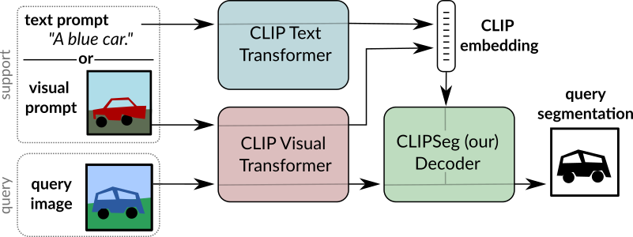

# Image Segmentation Using Text and Image Prompts
This repository contains the code used in the paper ["Image Segmentation Using Text and Image Prompts"](https://arxiv.org/abs/2112.10003).

**The Paper has been accepted to CVPR 2022!**



The systems allows to create segmentation models without training based on:
- An arbitrary text query
- Or an image with a mask highlighting stuff or an object.

### Quick Start

In the `Quickstart.ipynb` notebook we provide the code for using a pre-trained CLIPSeg model. If you run the notebook locally, make sure you downloaded the `rd64-uni.pth` weights, either manually or via git lfs extension.
It can also be used interactively using [MyBinder](https://mybinder.org/v2/gh/timojl/clipseg/HEAD?labpath=Quickstart.ipynb)
(please note that the VM does not use a GPU, thus inference takes a few seconds).


### Dependencies
This code base depends on pytorch, torchvision and clip (`pip install git+https://github.com/openai/CLIP.git`).
Additional dependencies are hidden for double blind review.


### Datasets

* `PhraseCut` and `PhraseCutPlus`: Referring expression dataset
* `PFEPascalWrapper`: Wrapper class for PFENet's Pascal-5i implementation
* `PascalZeroShot`: Wrapper class for PascalZeroShot
* `COCOWrapper`: Wrapper class for COCO.

### Models

* `CLIPDensePredT`: CLIPSeg model with transformer-based decoder.
* `ViTDensePredT`: CLIPSeg model with transformer-based decoder.

### Third Party Dependencies
For some of the datasets third party dependencies are required. Run the following commands in the `third_party` folder.  
```bash
git clone https://github.com/cvlab-yonsei/JoEm
git clone https://github.com/Jia-Research-Lab/PFENet.git
git clone https://github.com/ChenyunWu/PhraseCutDataset.git
git clone https://github.com/juhongm999/hsnet.git
```

### Weights

The MIT license does not apply to these weights. 

We provide two model weights, for D=64 (4.1MB) and D=16 (1.1MB).
```
wget https://owncloud.gwdg.de/index.php/s/ioHbRzFx6th32hn/download -O weights.zip
unzip -d weights -j weights.zip
```


### Training and Evaluation

To train use the `training.py` script with experiment file and experiment id parameters. E.g. `python training.py phrasecut.yaml 0` will train the first phrasecut experiment which is defined by the `configuration` and first `individual_configurations` parameters. Model weights will be written in `logs/`.

For evaluation use `score.py`. E.g. `python score.py phrasecut.yaml 0 0` will train the first phrasecut experiment of `test_configuration` and the first configuration in `individual_configurations`.


### Usage of PFENet Wrappers

In order to use the dataset and model wrappers for PFENet, the PFENet repository needs to be cloned to the root folder.
`git clone https://github.com/Jia-Research-Lab/PFENet.git `


### License

The source code files in this repository (excluding model weights) are released under MIT license.

### Citation
```
@InProceedings{lueddecke22_cvpr,
    author    = {L\"uddecke, Timo and Ecker, Alexander},
    title     = {Image Segmentation Using Text and Image Prompts},
    booktitle = {Proceedings of the IEEE/CVF Conference on Computer Vision and Pattern Recognition (CVPR)},
    month     = {June},
    year      = {2022},
    pages     = {7086-7096}
}

```
